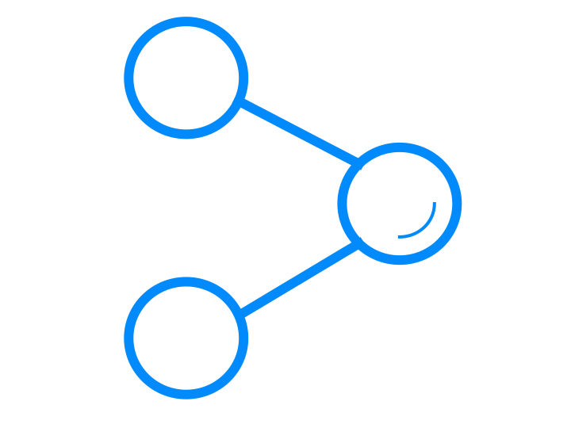

<p align="center">
    
</p>

# Grapl
Grapl is a graph-based SIEM platform built by-and-for incident response engineers.

## Details
Grapl leverages graph data structures at its core to ensure that you 
can query and connect your data efficiently, model complex attacker behaviors for detection, and
easily delve into suspicious behaviors to understand the full scope of an
ongoing intrusion.

For a more in depth overview of Grapl, read [this](https://insanitybit.github.io/2019/03/09/grapl).

Essentially, Grapl will take raw logs, convert them into graphs, and
merge those graphs into a Master Graph. It will then orchestrate the
execution of your attack signatures, and provide tools for performing
your investigations. 

You can watch some of our talks at [at
BSidesLV](https://www.youtube.com/watch?v=LjCtbpXQA9U&t=8028s) or
[at BSides San
Francisco](https://www.youtube.com/watch?v=uErWRAJ4I4w).

Grapl natively supports nodes for:
- Processes
- Files
- Networking

Grapl natively supports the following input formats to generate graphs:
- Sysmon logs
- osquery logs
- a generic JSON log format

Grapl is being developed with plugins in mind - operators can easily
support new input log formats and new node types.

Keep in mind that Grapl is not yet at a stable, 1.0 state, and is a
fast moving project. Expect some minor bugs and breaking changes!

[Key Features](https://github.com/grapl-security/grapl#key-features)

[Setup](https://github.com/grapl-security/grapl#setup)

Questions? Try opening an issue in this repo, or joining the [Grapl
slack channel (Click for
invite)](https://join.slack.com/t/grapl-dfir/shared_invite/zt-armk3shf-nuY19fQQuUnYk~dHltUPCw).

## Key Features

**Identity**

If you’re familiar with log sources like Sysmon, one of the best
features is that processes are given identities. Grapl applies the
same concept but for any supported log type, taking pseudo identifiers
such as process ids and discerning canonical identities.

Grapl then combines this identity concept with its graph approach,
making it easy to reason about entities and their behaviors. Further,
this identity property means that Grapl stores only unique information
from your logs, meaning that your data storage grows sublinear to the
log volume.

This cuts down on storage costs and gives you central locations to
view your data, as opposed to having it spread across thousands of
logs. As an example, given a process’s canonical identifier you can
view all of the information for it by selecting the node.


**Analyzers**
https://grapl.readthedocs.io/en/latest/analyzers/implementing.html

Analyzers are your attacker signatures. They’re Python modules,
deployed to Grapl’s S3 bucket, that are orchestrated to execute upon
changes to grapl’s Master Graph.

Rather than analyzers attempting to determine a binary "Good" or "Bad"
value for attack behaviors Grapl leverages a concept of Risk, and then
automatically correlates risks to surface the riskiest parts of your
environment.

Analyzers execute in realtime as the master graph is updated, using
constant time operations. Grapl's Analyzer harness will automatically
batch, parallelize, and optimize your queries. By leveraging constant
time and sublinear operations Grapl ensures that as your organization
grows, and as your data volume grows with it, you can still rely on
your queries executing efficiently.

Grapl provides an analyzer library so that you can write attacker
signatures using pure Python. See this [repo for
examples](https://github.com/grapl-security/grapl-analyzers).

Here is a brief example of how to detect a suspicious execution of `svchost.exe`,
```python
class SuspiciousSvchost(Analyzer):

    def get_queries(self) -> OneOrMany[ProcessQuery]:
        invalid_parents = [
            Not("services.exe"),
            Not("smss.exe"),
            Not("ngentask.exe"),
            Not("userinit.exe"),
            Not("GoogleUpdate.exe"),
            Not("conhost.exe"),
            Not("MpCmdRun.exe"),
        ]

        return (
            ProcessQuery()
            .with_process_name(eq=invalid_parents)
            .with_children(
                ProcessQuery().with_process_name(eq="svchost.exe")
            )
        )

    def on_response(self, response: ProcessView, output: Any):
        output.send(
            ExecutionHit(
                analyzer_name="Suspicious svchost",
                node_view=response,
                risk_score=75,
            )
        )
```
Keeping your analyzers in code means you can:

- Code review your alerts
- Write tests, integrate into CI
- Build abstractions, reuse logic, and generally follow best practices
  for maintaining software

Check out Grapl's [analyzer deployer
plugin](https://github.com/grapl-security/grapl-analyzer-deployer) to see
how you can keep your analyzers in a git repo that automatically
deploys them upon a push to master.

**Engagements**

Grapl provides a tool for investigations called an
Engagement. Engagements are an isolated graph representing a subgraph
that your analyzers have deemed suspicious.

Using AWS Sagemaker hosted Jupyter Notebooks and Grapl's provided
Python library you can expand out any suspicious subgraph to encompass
the full scope of an attack.  As you expand the attack scope with your
Jupyter notebook the Engagement Graph will update, visually
representing the attack scope.


**Event Driven and Extendable**

Grapl was built to be extended - no service can satisfy every
organization’s needs. Every native Grapl service works by sending and
receiving events, which means that in order to extend Grapl you only
need to start subscribing to messages.

This makes Grapl trivial to extend or integrate into your existing services.

Grapl also provides a Plugin system, currently in beta, that allows
you to expand the platforms capabilities - adding custom nodes and
querying capabilities.


## Setup
You can setup Grapl to run...
- [locally on your computer](https://www.graplsecurity.com/post/how-to-run-grapl-on-your-computer-in-15-minutes)
- [deploy on AWS](https://grapl.readthedocs.io/en/main/setup/aws.html#aws-setup) for optimal experience

