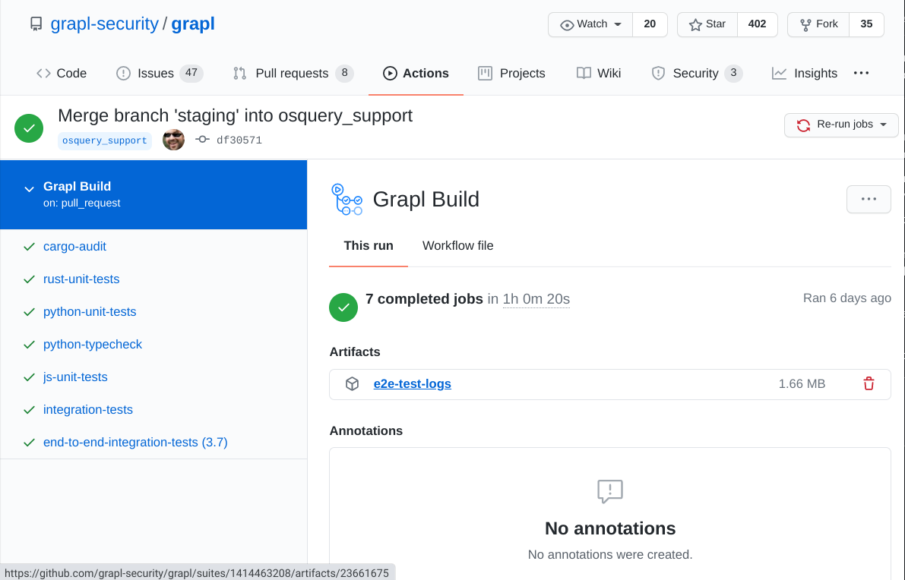

Debugging Integration Tests
===========================

Import a dgraph database from E2E Integration Tests
---------------------------------------------------
Let's say you ran a test on CI, and it failed, and you think this may be due to
the state of the database and not your code. Well, good news - we can reconstruct
the database from your Github test run!

- First, download the artifacts from your test run:

- Then, go to ``$GRAPLROOT`` and ``docker-compose up``.

- Unzip the artifacts and navigate to the folder that looks something like ``grapl-dgraph-data/dgraph.r4730.u1103.0108``

- Run ``dgraph live --files g01.rdf.gz`` - this uploads the database state to your local dgraph instance.

- Finally, you can explore on ``localhost:8000``. Here's an example query you can use:

.. code-block::

    {
    asset(func: type(Asset)) {
        uid
        hostname
        files_on_asset {
        uid
        }
        asset_processes {
        uid
        }
    }
    processes(func: type(Process)) @recurse(depth: 10, loop: false) {
        uid
        process_id
        process_name
        image_name
        created_timestamp
        terminate_time
        arguments
        children
        bin_file
        created_files
        wrote_files
        read_files
        deleted_files
    }
    file(func: type(File)) {
        uid
        path_name: file_path
    }
    }
