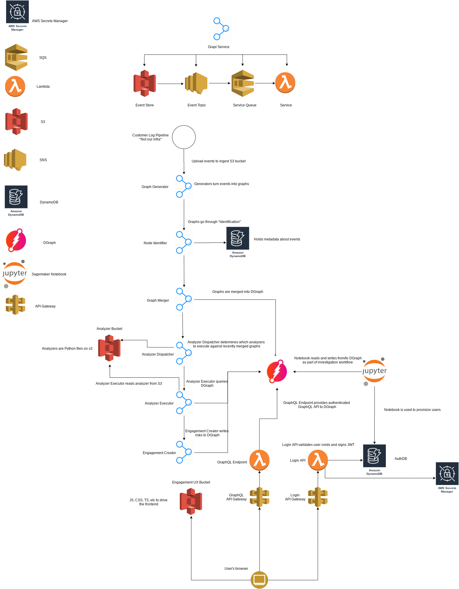

# Services

## Network Diagram

## Grapl Services - main pipeline

Unless otherwise specified, the input to a service is the output of the one
described above it.

### Graph Generator

**Input:** Event logs (e.g. sysmon logs, osquery logs, Cloudtrail logs) from the
customer's S3 bucket.

**Work:** Turns these events into a standalone subgraph, independent of existing
Dgraph state.

**Output:** Stores the subgraph to S3 for Node Identifier.

### Node Identifier

**Work:** Identifies nodes in the incoming subgraph against the canonical
identities of nodes in DynamoDB. The incoming nodes may be new, or they may
represent something already known in the master graph.

For instance, an incoming subgraph may refer to a process
`{PID:1234, name: "coolthing.exe", started at 1:00AM}`; it's possible that
Dgraph already has a node representing this exact same process. We'd like to
de-duplicate this process node.

**Output:** TODO

### Graph Merger

**Work:** Write the new edges and nodes from Node Identifier to Dgraph.

**Output:** TODO (it looks like exactly the same as node identifier's output,
just re-encoded?)

### Analyzer Dispatcher

**Work:** Determines which analyzers to execute against recently merged graphs

**Output:** TODO

### Analyzer Executor

**Work:** Executes queries against Dgraph, and - upon a successful query hit -
determines which lenses and risk nodes to create

**Output:** A JSON dump of risks and lenses to be created by the Engagement
Creator (see `analyzer_executor.py#emit_event` for specifics)

### Engagement Creator

**Work:** Simply appends the risks and lenses described in its input to Dgraph.

**Output:** Nothing is written to S3; the desired output is a mutation to
Dgraph.

## Other services

### Metric Forwarder

**Input:** This services receives `stdout` from other lambdas via Cloudwatch
Logs. We subscribe only to logs that contain the reserved keyword `MONITORING|`.

**Work:** Metric Forwarder parses these log lines - which are `statsd`
serialized metrics - and forwards them to Cloudwatch as metrics.

### Model Plugin Deployer

TODO

### Engagement View (aka UX)

Provides the main customer interaction with Grapl. This is not actually a
standalone service, but hosted as static assets inside Grapl Web UI.

### Graphql Endpoint

Graphql interface into our Dgraph database.

### Grapl Web UI

Provides authn/authz functions, and acts as a router to other services:

- Graphql Endpoint (/graphqlEndpoint)
- Model Plugin Deployer (current undergoing rewrite)

Also, hosts static assets like Engagement View.
